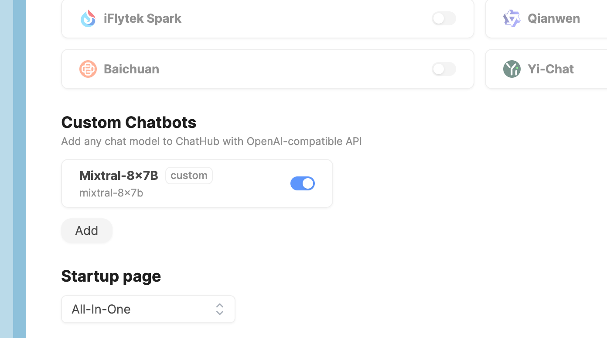
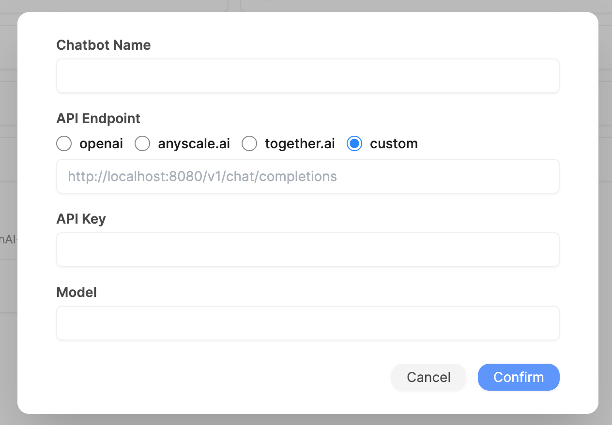

# Introduction

**Custom Chatbots** is a powerful feature that enabling you to add any chat models to ChatHub, as long as there's an OpenAI-compatible API.

You can configure **Custom Chatbots** in the Settings page of ChatHub.

Click the **Add** button to create a new custom chatbot.

## Examples

- [OpenAI](./openai)
- [Anyscale](./anyscale)
- [Together.ai](./together)
- [OpenRouter](./openrouter)
- [Xinference](./xinference)
- [Ollama](./ollama)
