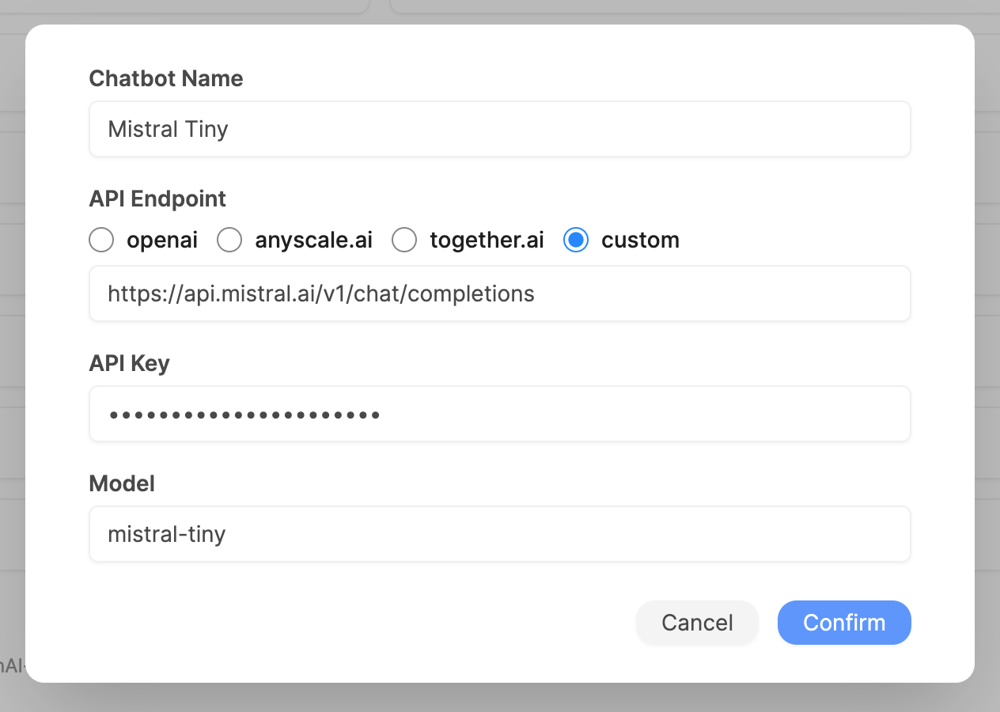

# Mistral AI Example

[Mistral AI](https://mistral.ai) has an API providing pay-as-you-go access to their latest models.

## Preparation

You can sign up from <https://console.mistral.ai>

Once you have an account, go to <https://console.mistral.ai/user/api-keys/> to create an API key.

## Configuration

- **API Endpoit**: `https://api.mistral.ai/v1/chat/completions`
- **Model**: `mistral-tiny`, `mistral-small`, `mistral-medium`, `mistral-large-latest`

## Troubleshooting

- Your account must have an active subscription for the API key to work.
- Newly created API key will take 2-3 minutes to start working.
