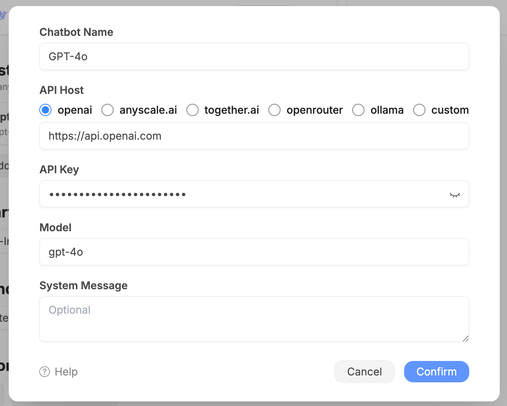

# OpenAI Example

Add a new custom chatbot with OpenAI API.

## Preparation

Get your **OpenAI API key** from <https://platform.openai.com/api-keys>.

## Configuration

We're using the `gpt-4-1106-preview` model in this example, which is the latest GPT-4 model.

You can find all the available models from OpenAI website: <https://platform.openai.com/docs/models/overview>.
