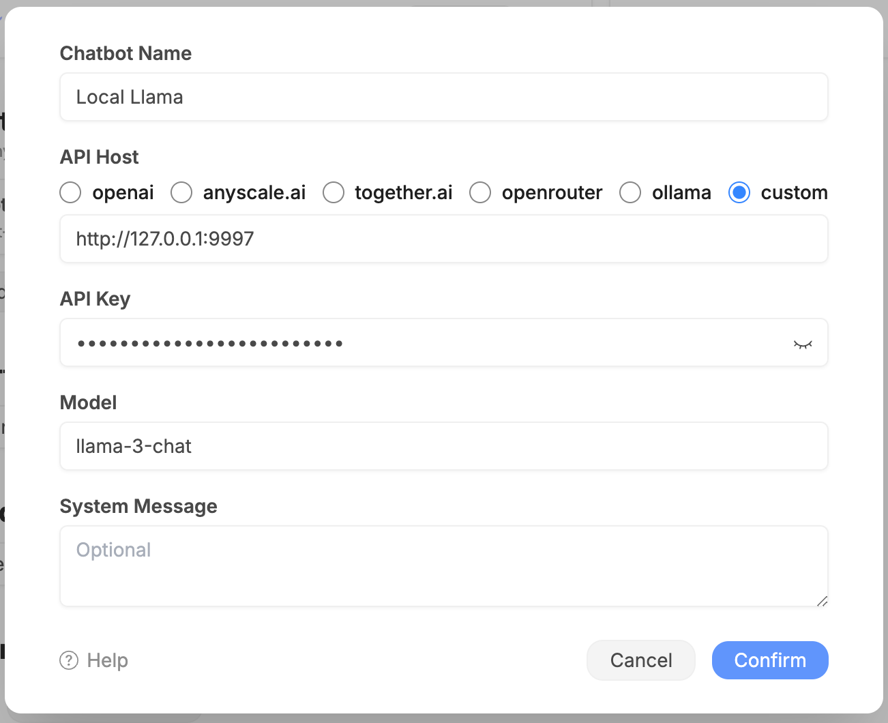

# Xinference Example

Xorbits Inference(Xinference) is an open-source project to run language models on your own machine. You can use it to serve open-source LLMs like Llama-2 locally.

## Preparation

Follow the instructions at [Using Xinference](https://inference.readthedocs.io/en/latest/getting_started/using_xinference.html) to setup Xinference and run the `llama-2-chat` model.

## Configuration

- **API Endpoit**: `http://127.0.0.1:9997/v1/chat/completions`
- **API Key**: random strings
- **Model**: `llama-2-chat`

You can find all the available models at <https://inference.readthedocs.io/en/latest/models/builtin/llm/index.html>

## Troubleshooting

- Only models with `chat` in their name are supported.
