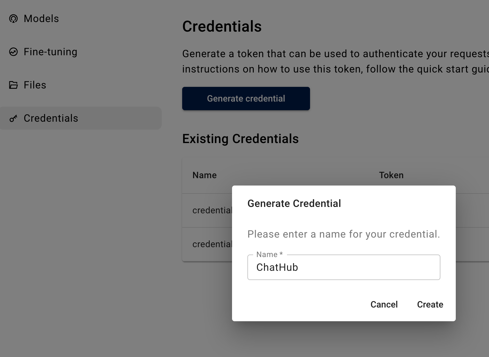
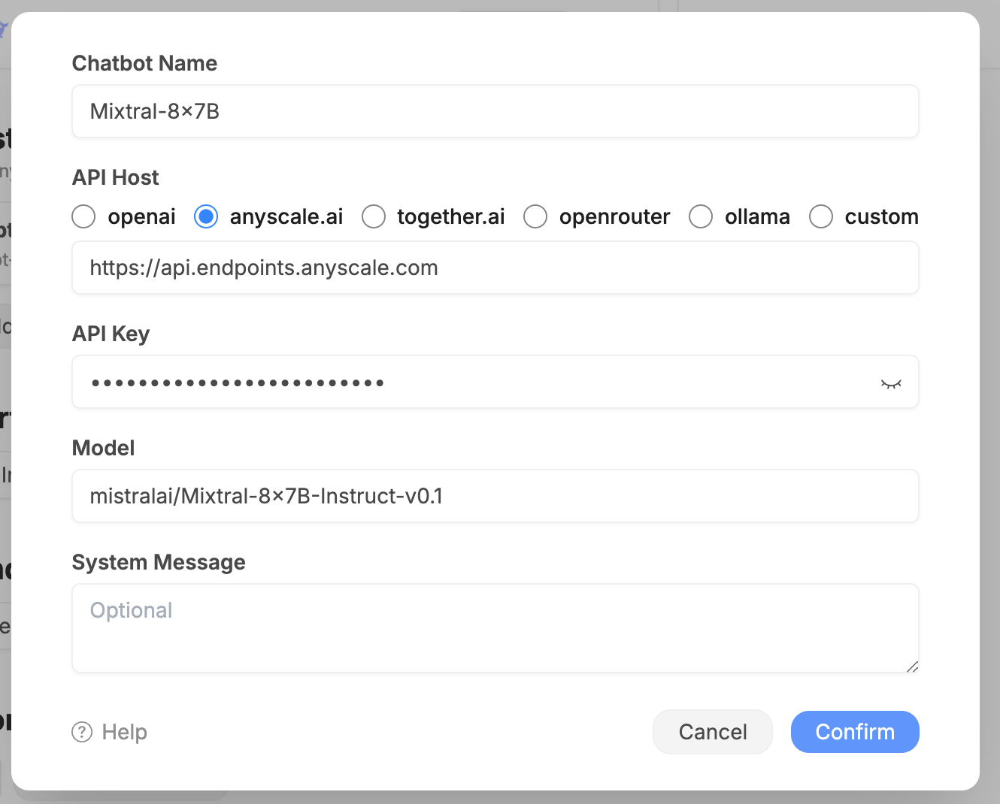

# Anyscale Example

[Anyscale](https://www.anyscale.com/endpoints) provides fast, cost-efficient, serverless APIs for LLM serving and fine tuning.

## Preparation

Sign up to Anyscale and generate an API key from <https://app.endpoints.anyscale.com/console/credentials>.

## Configuration

We're using the `mistralai/Mixtral-8x7B-Instruct-v0.1` model in this example.

You can find all the available models from Anyscale website: <https://docs.endpoints.anyscale.com/category/supported-models>
