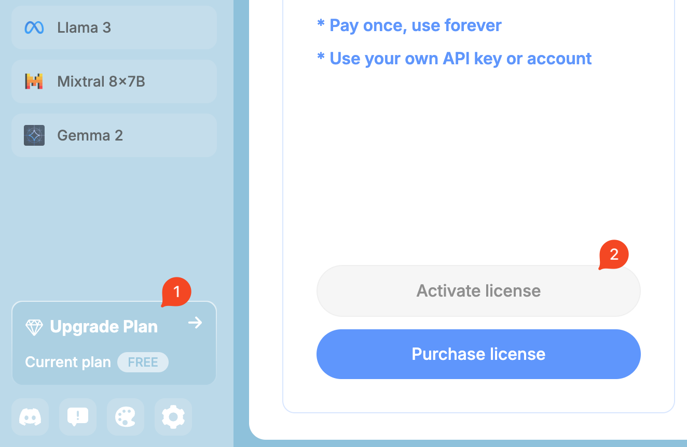

# ライフタイムメンバーシップ

ライフタイムメンバーシップでは、ユーザーは終生にわたってすべてのプレミアム機能にアクセスできます。一度の支払いを行うと、アプリをアクティブ化するためのライセンスキーを受け取ります。

> [!NOTE]
> ライフタイムメンバーシップは、ChatHubのブラウザ拡張機能でのみ使用でき、ChatHub Webappではアクティブ化できません。

## 購入方法

[ChatHubのブラウザ拡張機能](https://chathub.gg/chrome)からライフタイムメンバーシップを購入できます。

## ライセンスのアクティベーション

ライセンスキーを受け取ったら、ChatHub拡張機能からライセンスをアクティベートできます。

## デバイスまたはブラウザを変更したい場合はどうなりますか？

あなたのライフタイムメンバーシップに関連するデバイスまたはブラウザを変更したい場合は、そのデバイスで非アクティブ化してから、別のデバイスで再アクティベートできます。このプロセスにより、必要に応じてメンバーシップをデバイス間で移行できます。

## アクティベーションの回数に制限はありますか？

いいえ、アクティベーションの回数に制限はありません。ただし、購入した価格プランに対応するブラウザの数にのみ、メンバーシップをアクティブにできます。

## メンバーシップをより高いTierにアップグレードするにはどうすればよいですか？

あなたのメンバーシップをより高いTierにアップグレードしたい場合（例: 1ブラウザから3ブラウザに）、お問い合わせください。

## アクティベーションの管理

ChatHub拡張機能で現在のアクティベーションを非アクティブ化できます。

また、すべてのアクティベーションを表示して管理するための専用のツールも提供しています:
https://app.chathub.gg/license-manager