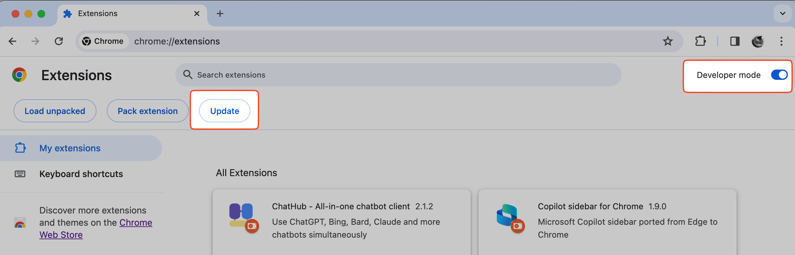

# ChatHubの手動更新方法

Chromeは自動的に拡張機能を更新しますが、更新のタイミングは明確ではありません。最新バージョンに手動でChatHubを更新したい場合は、以下の手順を実行してください。

1. Chromeの拡張機能ページ(`chrome://extensions/`)を開く。
2. "Developer mode"スイッチを有効にする。
3. "Update"ボタンをクリックする。

